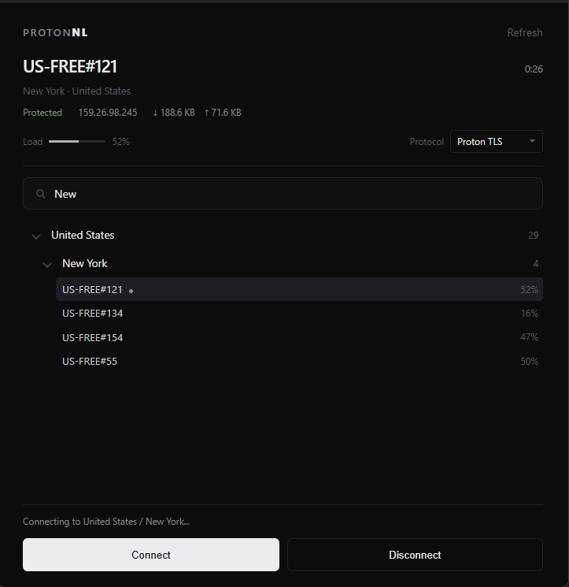

# ProtonNL

**NL stands for NO LIES.**

Unofficial ProtonVPN helper for Windows. Kills the Change Server cooldown and lets you pick any free region.



Not affiliated with Proton AG.

## Run

Grab a [release](https://github.com/1xpixi/ProtonNL/releases), start ProtonVPN, then run `ProtonNL.Loader.exe`.

A local page opens at `http://127.0.0.1:27180/`. If it does not, open that URL yourself.

## Build

CMake, VS 2022 (x64), .NET 8 SDK:

```bat
cmake -S . -B build -G "Visual Studio 17 2022" -A x64
cmake --build build --config Release
```
